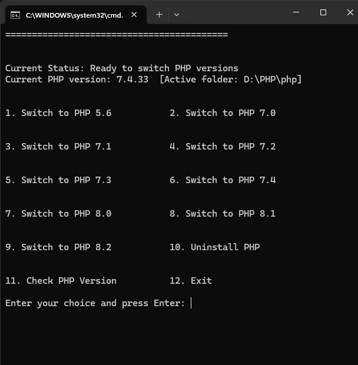

# PHP Version Switcher

Windows batch utility for managing multiple local PHP installations living under `D:\PHP`. The script exposes a simple menu that lets you check the active version, swap between pre-installed builds, or temporarily uninstall the active build while keeping the versioned folders intact.



## Features

- Detects and displays the currently active PHP version and folder.
- Switches between versioned folders (`php-5.6`, `php-7.0`, … `php-8.2`) by renaming them into the active `php` directory.
- Falls back safely if switching fails, restoring the previous version when possible.
- Uninstalls the active build (moves it back to its versioned folder) without deleting files.
- Emits an audible prompt before pausing so you know an action finished.

## Requirements

- Windows (tested with PowerShell and Command Prompt).
- PHP builds stored as `D:\PHP\php-<version>` directories.
- Environment variable (system or user level) pointing to `D:\PHP\php` for your shell or IDE.

## Getting Started

1. Place `php-switcher.bat` in `D:\PHP`.
2. Ensure each PHP build you want to manage lives in a versioned folder, e.g. `D:\PHP\php-7.4`.
3. The active version should live in `D:\PHP\php` before you start using the switcher.
4. Launch the script from PowerShell or Command Prompt:

   ```powershell
   cd D:\PHP
   .\php-switcher.bat
   ```

## Usage

- Use the numbered menu to select an action.
- Options `1-9` activate the corresponding PHP version.
- Option `10` moves the active build back to its versioned folder (no active PHP remains).
- Option `11` prints the version detected via `php -v`.
- Option `12` exits.

After each operation the script pauses; press any key to return to the menu.

## Customizing

- Add additional PHP versions by placing new `php-<version>` folders beside the existing ones and extending the menu/switch logic if needed.
- Update the `BASE_DIR` variable at the top of the script if your PHP directory lives somewhere other than `D:\PHP`.

## Troubleshooting

- **Unknown version**: ensure `php\php.exe` exists and that your environment PATH points to the correct directory.
- **Rename conflicts**: if a `php-<version>` directory already exists, rename or remove it before switching.
- **Permission errors**: run the shell as Administrator if Windows prevents renaming folders in `D:\PHP`.

## License

Distributed under the MIT License. See `LICENSE` (add your preferred license file) for details.

