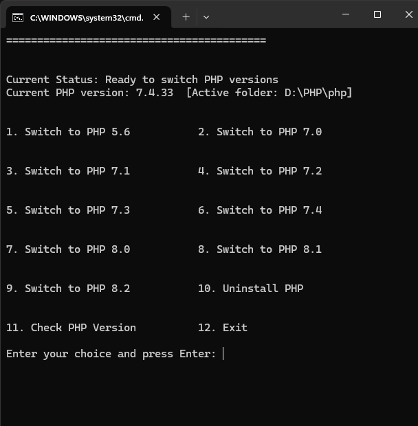

# PHP Version Switcher for Laravel

Windows batch utility for managing multiple local PHP installations living under `D:\PHP`. The script exposes a simple numbered menu that lets you check the active version, uninstall it, or swap between pre-installed builds — all without deleting any files.



## Features

- Detects and displays the currently active PHP version and folder.
- Switches between versioned folders (`php-5.6`, `php-7.0`, … `php-8.5`) by renaming them into the active `php` directory.
- Falls back safely if switching fails, restoring the previous version when possible.
- Uninstalls the active build (moves it back to its versioned folder) without deleting files.
- Emits an audible prompt before pausing so you know an action finished.

## Requirements

- Windows (tested with PowerShell and Command Prompt).
- PHP builds stored as `D:\PHP\php-<version>` directories.
- Environment variable (system or user level) pointing to `D:\PHP\php` for your shell or IDE.

## Add PHP to the Environment Variable

1. Open Windows Search and type **Environment Variables**; choose **Edit the system environment variables**.
2. In the **System Properties** window, click **Environment Variables…**.
3. Under **System variables**, select `Path` and click **Edit**.
4. Click **New**, enter `D:\PHP\php`, and confirm with **OK** on all dialogs.
5. Restart any open terminals or IDEs so they pick up the updated PATH.

## Getting Started

1. Download or clone this repository, then copy all included files and folders into `D:\PHP`.
2. Place `php-switcher.bat` in `D:\PHP` (should already be covered if you copied everything).
3. Ensure each PHP build you want to manage lives in a versioned folder, e.g. `D:\PHP\php-8.3`.
4. The active version should live in `D:\PHP\php` before you start using the switcher.
5. Launch the script from PowerShell or Command Prompt:

   ```powershell
   cd D:\PHP
   .\php-switcher.bat
   ```

## Usage

Use the numbered menu to select an action. After each operation the script pauses; press any key to return to the menu.

| Option | Action |
|--------|--------|
| `1` | Check PHP Version — prints the version detected via `php -v` |
| `2` | Uninstall PHP — moves the active build back to its versioned folder |
| `3` | Switch to PHP 5.6 |
| `4` | Switch to PHP 7.0 |
| `5` | Switch to PHP 7.1 |
| `6` | Switch to PHP 7.2 |
| `7` | Switch to PHP 7.3 |
| `8` | Switch to PHP 7.4 |
| `9` | Switch to PHP 8.0 |
| `10` | Switch to PHP 8.1 |
| `11` | Switch to PHP 8.2 |
| `12` | Switch to PHP 8.3 |
| `13` | Switch to PHP 8.4 |
| `14` | Switch to PHP 8.5 |
| `15` | Exit |

## Supported PHP Versions

The following PHP builds are supported out of the box (place them in the corresponding folders):

| Folder | PHP Version |
|--------|-------------|
| `D:\PHP\php-5.6` | PHP 5.6 |
| `D:\PHP\php-7.0` | PHP 7.0 |
| `D:\PHP\php-7.1` | PHP 7.1 |
| `D:\PHP\php-7.2` | PHP 7.2 |
| `D:\PHP\php-7.3` | PHP 7.3 |
| `D:\PHP\php-7.4` | PHP 7.4 |
| `D:\PHP\php-8.0` | PHP 8.0 |
| `D:\PHP\php-8.1` | PHP 8.1 |
| `D:\PHP\php-8.2` | PHP 8.2 |
| `D:\PHP\php-8.3` | PHP 8.3 |
| `D:\PHP\php-8.4` | PHP 8.4 |
| `D:\PHP\php-8.5` | PHP 8.5 |

## Customizing

- Add additional PHP versions by placing new `php-<version>` folders beside the existing ones and extending the menu/switch logic in `php-switcher.bat` if needed.
- Update the `BASE_DIR` variable at the top of the script if your PHP directory lives somewhere other than `D:\PHP`.

## Troubleshooting

- **Wrong version shown after switch**: verify that the `php-<version>` folder actually contains the correct PHP build. Run option `1` (Check PHP Version) to confirm.
- **Unknown version**: ensure `php\php.exe` exists and that your environment PATH points to `D:\PHP\php`.
- **Rename conflicts**: if a `php-<version>` directory already exists when switching, rename or remove it before retrying.
- **Permission errors**: run the shell as Administrator if Windows prevents renaming folders in `D:\PHP`.

## License

Distributed under the MIT License. See `LICENSE` (add your preferred license file) for details.
